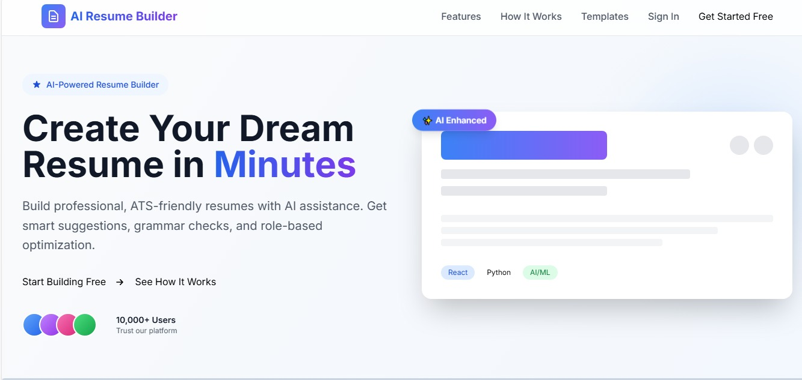
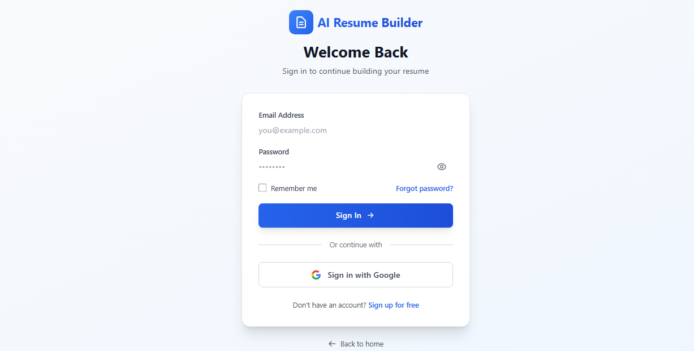
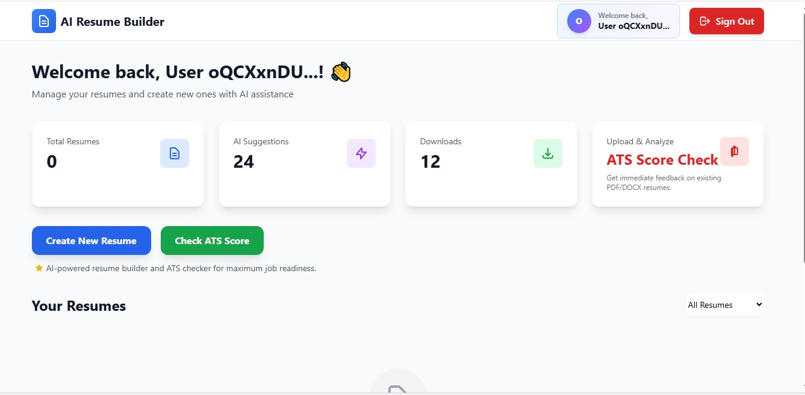
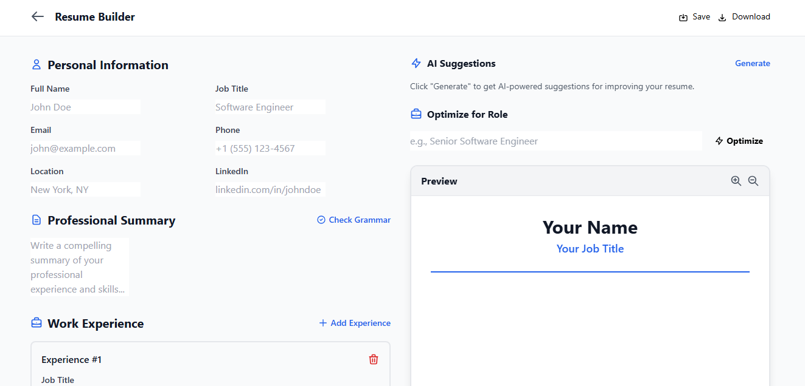
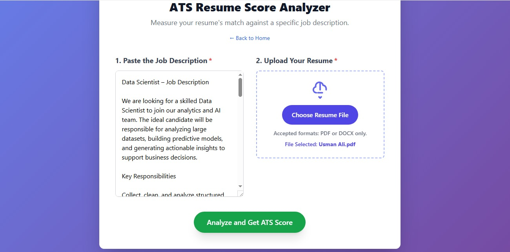

# AI-ATS-Resume-Builder

An AI-powered web application that helps users create, analyze, and optimize professional resumes in minutes. The platform integrates Firebase for authentication and data storage, and uses AI (Gemini API) for resume writing, keyword optimization, and ATS (Applicant Tracking System) scoring.

## 🌐 Landing Pages Preview

### 🏠 1. Home Page
> A clean, responsive interface introducing the AI Resume Builder and its main features.

---

### 👤 2. Sign In / Sign Up Page
> Firebase Authentication page for secure login and registration.

---

### 🧾 3. Resume Builder Dashboard
> The main workspace where users create, edit, and optimize their resumes using AI.

---

### 📄 4. Resume Builder Page
> The main builder where users enter their personal details, education, and experience — then generate, analyze, and optimize their resume using Gemini AI.

---

### 📄 5. ATS Score Page
> Optimize your resume for Applicant Tracking Systems (ATS) with AI-powered feedback and suggestions.

 

## 🧑‍💻 Developed By
**Usman Ali**

---

© 2025 Usman Ali — All Rights Reserved  
🔒 *DevArion Solution*
